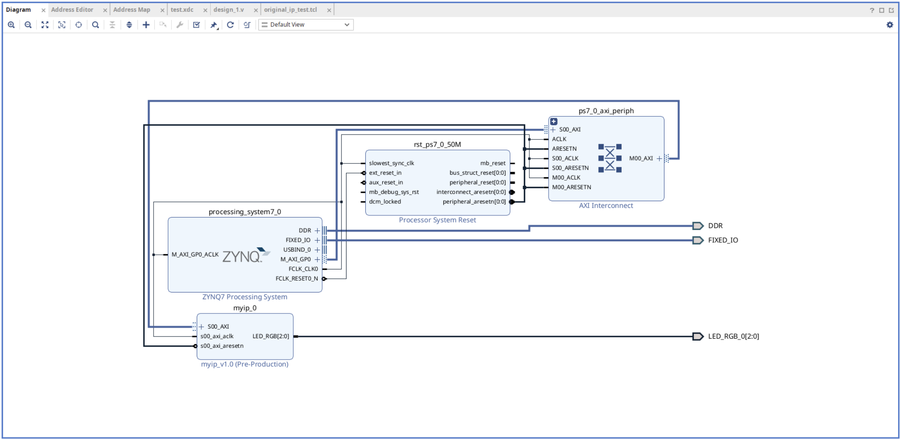

# Original BD Test
This repository is a sample project for Vivado using non-project mode.

## Directory Description
### /ip
Contains IP files used as sources for the original IP core. This directory is a copy from the IP repository used in the Vivado GUI.

### /src/const
Holds constraint files.

### /src/ip
Contains XCI files. If you want to use non-original files, place them in this directory.

### /blockdesign
Contains exported Block Design TCL files.

## Block Design Overview
